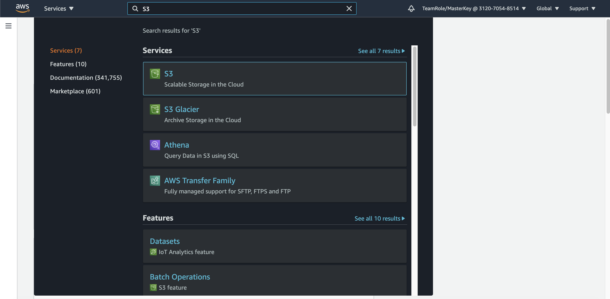
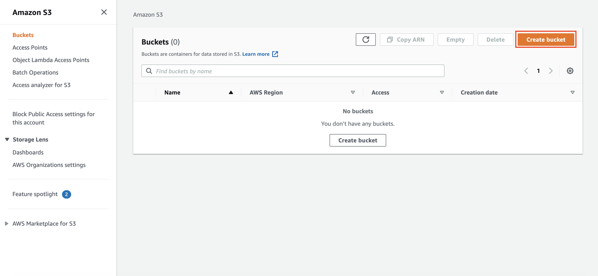
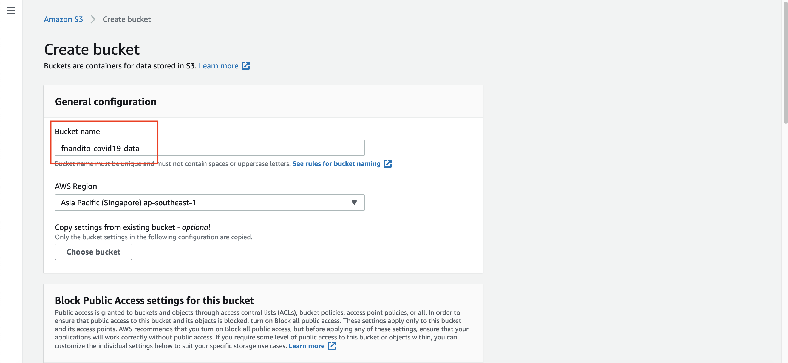
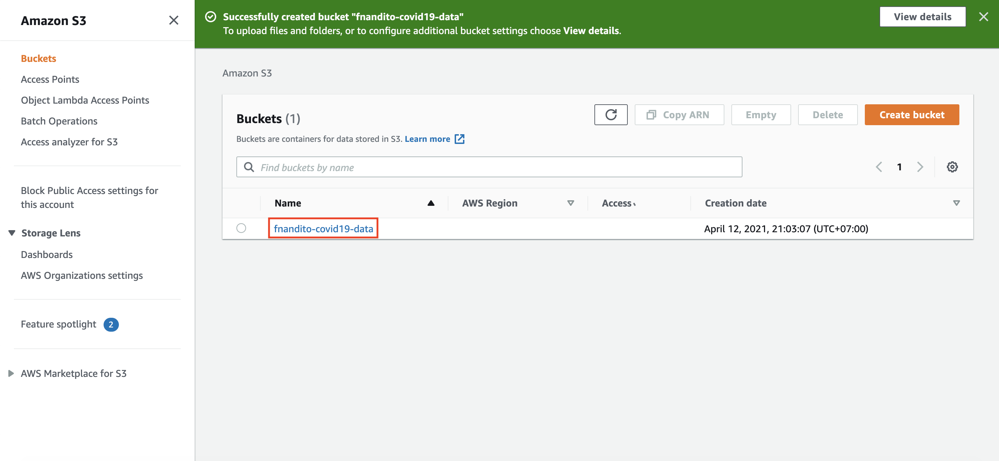
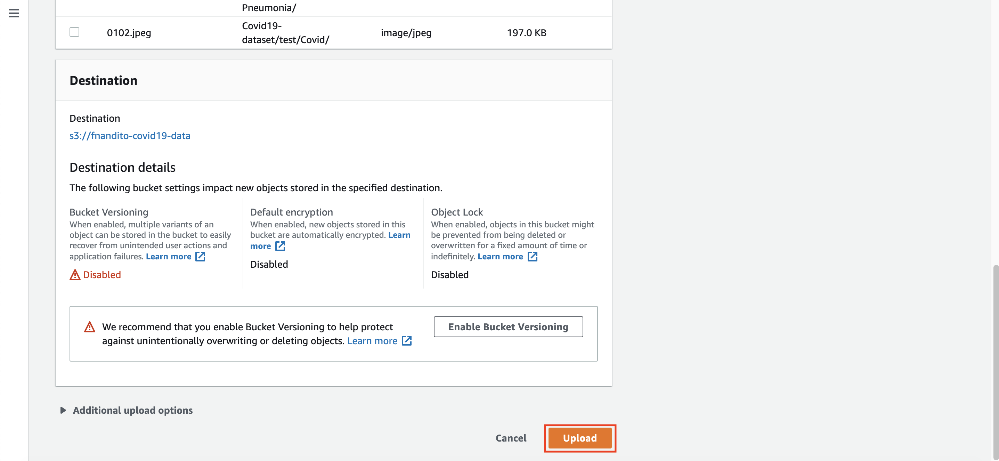

# Setup S3 for Storing Data

1. Go to [AWS Console](https://ap-southeast-1.console.aws.amazon.com/console/home?region=ap-southeast-1)
2. Type `S3` at the top search bar and click `S3` service
    

S3 is an object storage service from AWS that we will use to integrate to our Machine Learning service, to be used as a training and testing Data.

3. In S3 Page, click `Create bucket`
    

4. in your bucket name, fill with your bucket name, example `yourname-covid19-data`. Please save the name for later workshop.
    

5. scroll down, and click `Create bucket`

Once your S3 bucket is ready, now we need to upload the dataset there.

6. Click your S3 bucket name
    

7. you can drag and drop your data, or click `Upload` button and upload your folder `Covid19-dataset`
8. Once the confirmation page is appear, scroll down and click `Upload`
    

    

This process might take a while.

[BACK TO WORKSHOP GUIDE](../README.md)