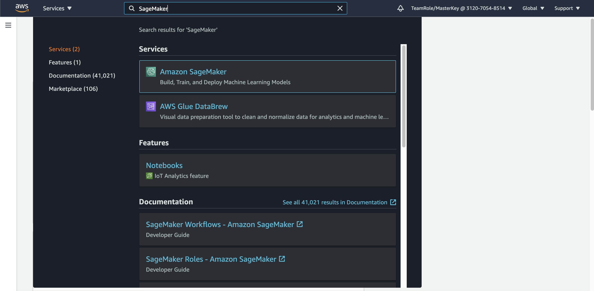
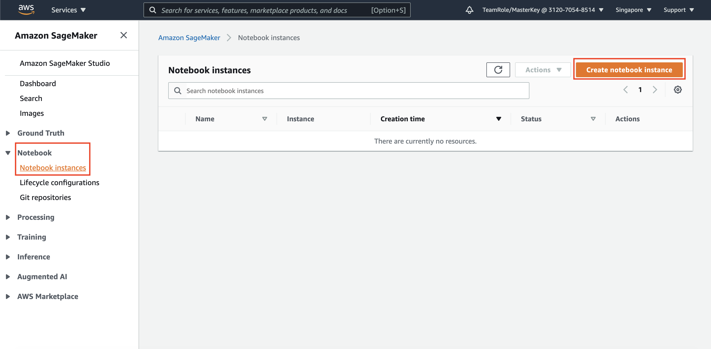
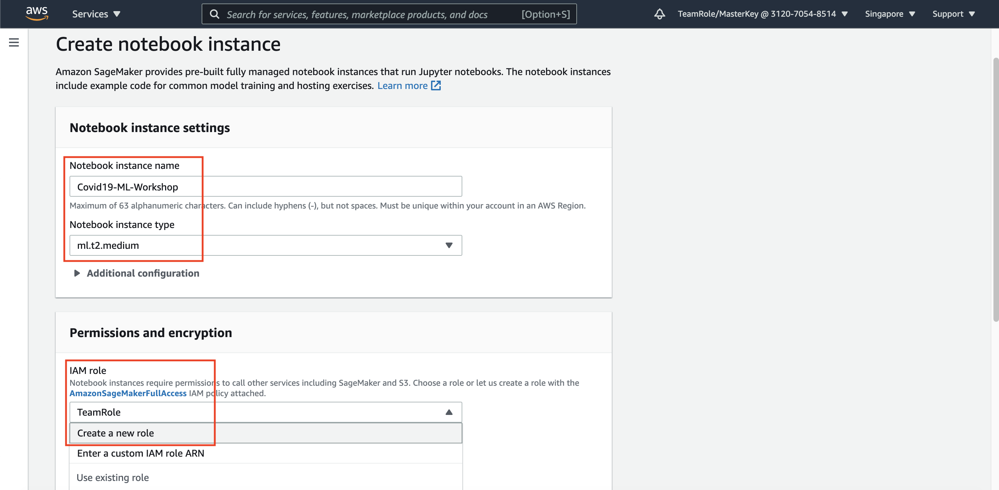
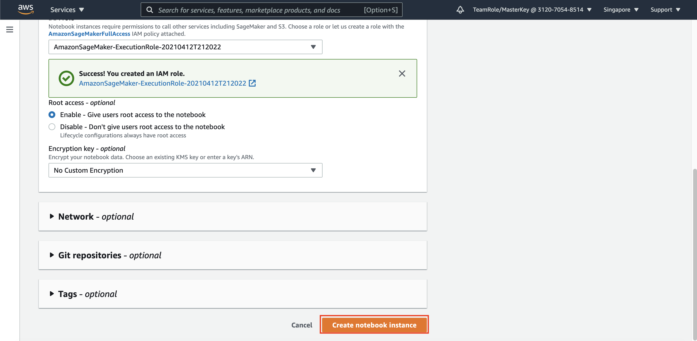
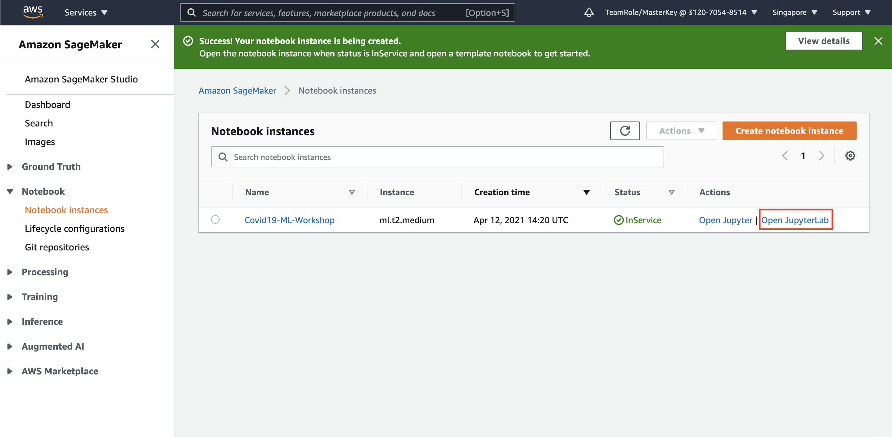
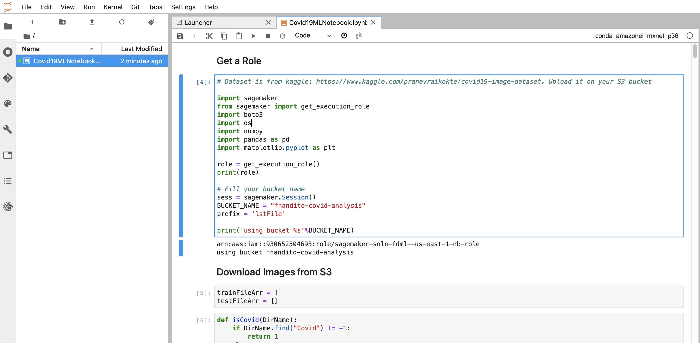

# Create SageMaker Notebook for staging and test Machine Learning

1. Go to [AWS Console](https://ap-southeast-1.console.aws.amazon.com/console/home?region=ap-southeast-1)
2. Type `SageMaker` at the top search bar, and click `Amazon SageMaker` service
    

Amazon SageMaker is a Machine Learning service from AWS that helps to data collection, development, testing, until deployment of machine learning. For more information, Please take a look at the [cycle here](https://docs.aws.amazon.com/sagemaker/latest/dg/how-it-works-mlconcepts.html)

There are several tools that you can use. For now, we are using SageMaker Notebook. The interface is similarly with Jupyter Notebook.

3. Append `Notebook` Menu
4. click `Notebook Instances`
5. click `Create Notebook Instance`
    

6. in Notebook instance settings, fill the notebook name as `Covid19-ML-Workshop`
7. Leave the instance type as `t2.medium`
8. In permission, choose `Create a New Role` on IAM Role section
    

9. in IAM role page, choose `Any S3 bucket` and click `Create Role`
10. Click `Create Notebook Instance`
    

This process will take 5 until 15 minutes to run.
Once it's done, Click `Jupyter Lab`

11. Click `Open JupyterLab`
    

It will open the JupyterLab page.

12. Download [This Python Notebook](../Assets/Covid19MLNotebook.ipynb)
13. In your JupyterLab, drag and drop the Python notebook
14. Follow the instruction on the notebook.

you will get the display like this.
    

[BACK TO WORKSHOP GUIDE](../README.md)